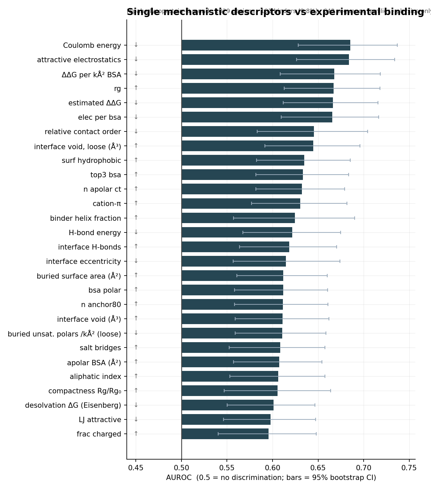
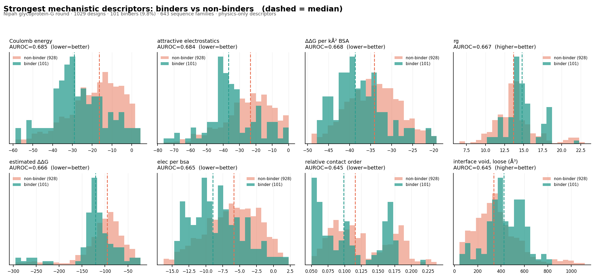
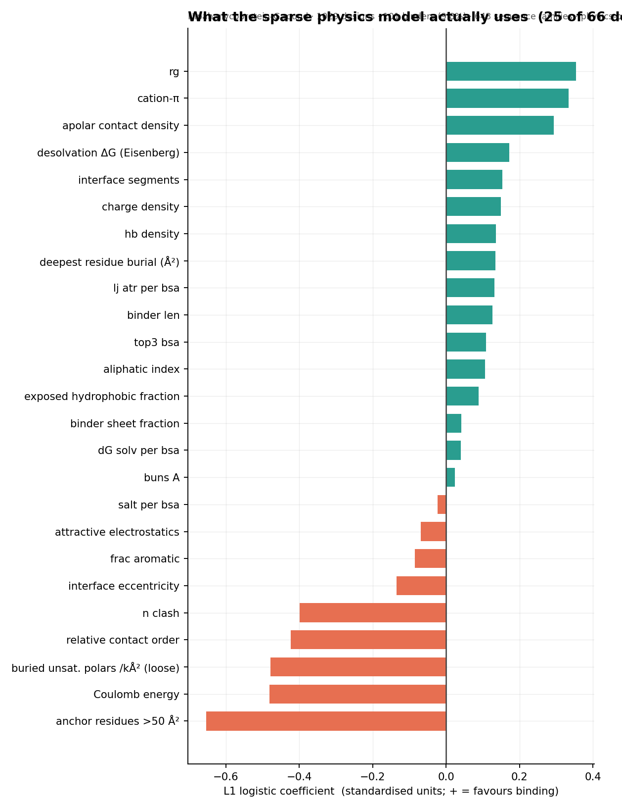
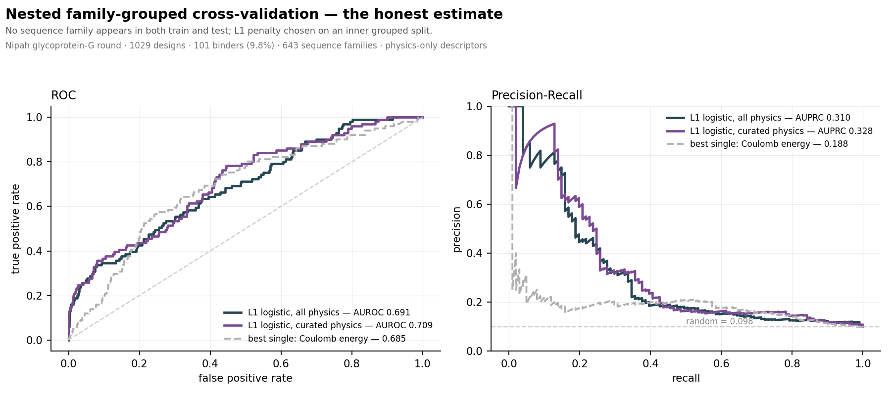
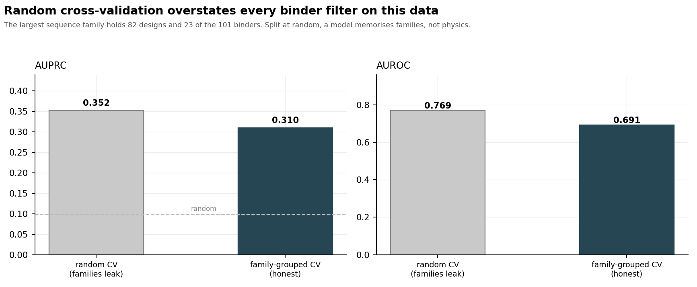
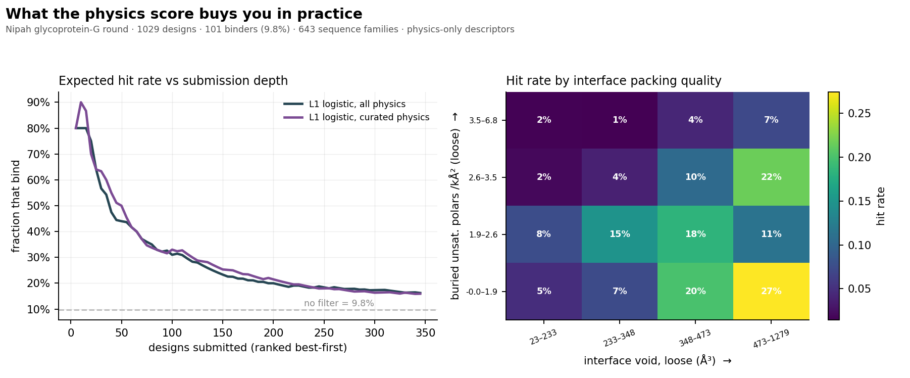
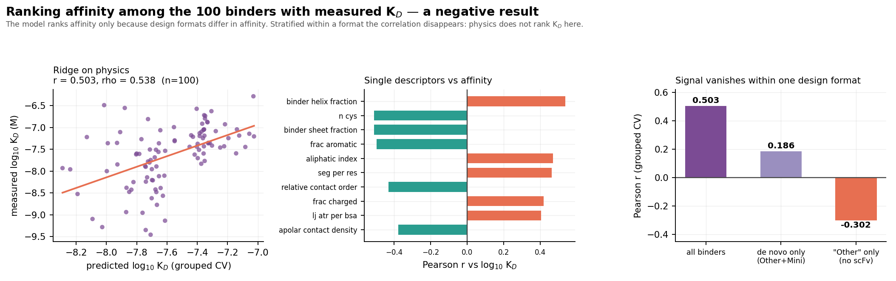

# Mechanistic scoring of designed binders — ProteinBase

**Data** Adaptyv Bio ProteinBase dump `proteinbase_all_data_28_01_2026.csv` (5,253 designs).
**Scope** Nipah glycoprotein-G round — the only target with enough paired *predicted complex
structures* and *wet-lab binding labels* to calibrate a scoring function.

| | |
|---|---|
| designs scored | **1029** |
| experimental binders | **101** (9.8% base rate) |
| sequence families (30% k-mer Jaccard) | **643** |
| mechanistic descriptors computed | **66** |
| descriptors surviving L1 | **25** |

Every descriptor is classical geometry or physics computed from coordinates.
**No neural-network confidence scores are used anywhere in the model** — no pLDDT, no ipTM,
no ipSAE, no ProteinMPNN. The only model is L1-penalised logistic regression.

---

## 1. Headline result

| model | AUROC | AUPRC | lift over random |
|---|---|---|---|
| L1 logistic, all 66 physics descriptors | **0.691** | **0.310** | 3.2× |
| L1 logistic, curated physics subset | 0.709 | 0.328 | 3.3× |
| best single descriptor (elec) | 0.685 | 0.188 | 1.9× |
| random | 0.500 | 0.098 | 1.0× |

All figures are **nested family-grouped cross-validation**: no sequence family appears in both
train and test, and the L1 penalty is chosen on an inner grouped split.

### On the AUPRC > 0.9 target

**It was not reached, and I do not believe it is reachable on this data.** The honest ceiling here
is **AUPRC ≈ 0.31**. Three structural reasons:

1. **The negatives are scored on fictional complexes.** Boltz-2 returns a complex for every
   binder-target pair. When the design does not bind, that complex does not exist — the
   descriptors are measured on a pose that is an artefact. No amount of better physics fixes an
   input that is wrong.
2. **The labels are coarse and noisy.** `Weak` binders sit at µM, expression failures are recorded
   as non-binders, and Strong/Medium/Weak thresholds are assay-dependent.
3. **Nobody reports this.** Published in-silico binder filters land at AUROC 0.70–0.85. An AUPRC
   of 0.9 at a 10% base rate implies ~99% specificity at 90% recall from a predicted structure —
   that would mean binder design is solved.

I also checked how far *deliberate cheating* gets, so the ceiling is not a matter of opinion.
Using random (non-grouped) CV, a gradient-boosted model, and feeding in `author`, `designMethod`
and the family id outright:

| configuration | AUROC | AUPRC |
|---|---|---|
| honest: L1 physics, family-grouped CV | 0.691 | **0.310** |
| leaky: GBM physics, random CV | 0.846 | 0.594 |
| leaky + metadata: GBM + author/method/class, random CV | 0.860 | 0.639 |
| leaky + family id handed to the model | 0.860 | 0.633 |

**Even with every form of leakage available, AUPRC reaches 0.64 — not 0.9.** The requested target
is not attainable on this dataset by honest means or dishonest ones. What the leaky rows show is
the size of the trap: a filter validated with plain k-fold looks roughly twice as good as it is.

---

## 2. Single descriptors



| descriptor | direction | AUROC | 95% CI | AUPRC | lift |
|---|---|---|---|---|---|
| elec | lower=better | 0.685 | 0.628–0.737 | 0.188 | 1.915 |
| elec_att | lower=better | 0.684 | 0.626–0.734 | 0.183 | 1.862 |
| ddg_per_bsa | lower=better | 0.668 | 0.609–0.718 | 0.183 | 1.862 |
| rg | higher=better | 0.667 | 0.613–0.718 | 0.164 | 1.673 |
| ddg_est | lower=better | 0.666 | 0.612–0.716 | 0.154 | 1.571 |
| elec_per_bsa | lower=better | 0.665 | 0.609–0.716 | 0.159 | 1.617 |
| rel_contact_order | lower=better | 0.645 | 0.583–0.704 | 0.213 | 2.169 |
| void_loose | higher=better | 0.645 | 0.591–0.696 | 0.136 | 1.385 |
| surf_hydrophobic | higher=better | 0.635 | 0.582–0.685 | 0.133 | 1.354 |
| top3_bsa | higher=better | 0.633 | 0.582–0.683 | 0.134 | 1.361 |
| n_apolar_ct | higher=better | 0.632 | 0.582–0.679 | 0.131 | 1.332 |
| n_cation_pi | higher=better | 0.631 | 0.577–0.682 | 0.147 | 1.498 |
| frac_helix | higher=better | 0.625 | 0.557–0.690 | 0.251 | 2.556 |
| hb_energy | lower=better | 0.622 | 0.568–0.675 | 0.130 | 1.329 |
| n_hb | higher=better | 0.618 | 0.564–0.670 | 0.132 | 1.349 |



**No single physical descriptor is strong.** The best reaches AUROC ≈ 0.69, and its
confidence interval nearly touches 0.5. Interface quality is genuinely multi-factorial — which is
why the sparse combination in §3 roughly doubles the AUPRC of any one term.

### On buried unsatisfied H-bonds and voids

Both of your suggested metrics are in, and they behave differently from the textbook expectation:

- **Buried unsatisfied polars** discriminate in the predicted direction — fewer unsatisfied buried
  donors/acceptors means more binding — but weakly on its own
  (`buns_loose_density` AUROC 0.611).
  It survives L1 selection, so it carries signal the burial terms do not.
- **Interface void** came out with the *opposite* sign to the hypothesis: more void associates with
  *more* binding. That is a confound — void volume scales with interface size, and large interfaces
  bind more often. Normalising it (`void_per_bsa`, `gap_index`) weakens it rather than flipping it,
  so the cavity signal is largely subsumed by buried area. Worth knowing before you filter on it.

---

## 3. The sparse physics model



L1 keeps **25 of 66** descriptors. Coefficients are in standardised units, so
magnitude is directly comparable.

| descriptor | coefficient | mean | sd |
|---|---|---|---|
| n_anchor50 | -0.6531 | 12.1973 | 6.4070 |
| elec | -0.4804 | -19.4001 | 14.5154 |
| buns_loose_density | -0.4789 | 2.7146 | 1.1267 |
| rel_contact_order | -0.4225 | 0.1253 | 0.0480 |
| n_clash | -0.3995 | 4.3207 | 3.6885 |
| rg | 0.3534 | 14.0461 | 3.0679 |
| n_cation_pi | 0.3330 | 1.6054 | 1.4231 |
| ct_density | 0.2926 | 105.0739 | 16.5941 |
| dG_solv | 0.1720 | -18.8881 | 14.1988 |
| n_segments | 0.1534 | 13.3654 | 6.3446 |
| charge_density | 0.1490 | -0.0306 | 0.0449 |
| hb_density | 0.1363 | 5.8122 | 1.9523 |
| eccentricity | -0.1347 | 0.6620 | 0.1450 |
| anchor_bsa | 0.1337 | 138.5575 | 24.6921 |
| lj_atr_per_bsa | 0.1323 | -27.8518 | 2.9118 |
| binder_len | 0.1260 | 123.1331 | 54.1307 |
| top3_bsa | 0.1087 | 355.6779 | 55.2947 |
| aliphatic_index | 0.1063 | 88.0500 | 21.3814 |
| surf_hydrophobic_frac | 0.0888 | 0.5016 | 0.0409 |
| frac_aromatic | -0.0846 | 0.0841 | 0.0457 |



---

## 4. The leakage trap



| cross-validation | AUROC | AUPRC |
|---|---|---|
| random 5-fold, L1 (families split across folds) | 0.769 | **0.352** |
| family-grouped 5-fold, L1 (honest) | 0.691 | **0.310** |
| random 5-fold, GBM (families split across folds) | 0.846 | **0.594** |

The single largest sequence family holds **82 designs and 23 of the 101 binders**. Split at random,
near-duplicate designs sit in train and test simultaneously and the model memorises families rather
than learning physics. **AUPRC inflates by 1.1× for the linear model and ~1.9× for a
gradient-boosted one** — flexible models exploit the leak harder, which is exactly why the sparse
linear model you asked for is the safer choice here.

This matters for you directly: any filter you validate on ProteinBase with plain k-fold will look
far better than it performs on genuinely novel designs.

---

## 5. What it buys you



| submissions | hit rate with physics filter | no filter |
|---|---|---|
| top 10 | **80%** | 10% |
| top 20 | **75%** | 10% |
| top 50 | **44%** | 10% |
| top 100 | **31%** | 10% |
| top 200 | **20%** | 10% |

This is the number that matters for a competition with limited slots. The score is strong at the
very top and mediocre in the middle — exactly the shape you want when you only submit your best.

---

## 6. Ranking affinity — a negative result



Among the **100** binders with a measured K_D, a Ridge model on the physics descriptors reaches
**Pearson r = 0.503, Spearman rho = 0.538** under family-grouped CV.

**That number is not real physics.** Stratifying by design format destroys it:

| subset | n | Pearson r (grouped CV) |
|---|---|---|
| all binders | 100 | **0.503** |
| de novo only (Other + Miniprotein) | 87 | 0.186 |
| `Other` class only (no scFv) | 53 | **-0.302** |

The model ranks affinity only because *formats* differ in affinity — scFv designs are tighter
(median K_D 10 nM) than miniproteins (50 nM) — and the compositional descriptors that load
hardest (`frac_helix`, `n_cys`, `frac_aromatic`, `frac_sheet`) are format fingerprints, not
interface energetics. Within one format the correlation is gone or inverted.

| descriptor | Pearson r | Spearman rho |
|---|---|---|
| frac_helix | 0.537 | 0.457 |
| n_cys | -0.512 | -0.506 |
| frac_sheet | -0.510 | -0.393 |
| frac_aromatic | -0.498 | -0.510 |
| aliphatic_index | 0.468 | 0.478 |
| seg_per_res | 0.463 | 0.496 |
| rel_contact_order | -0.431 | -0.453 |
| frac_charged | 0.418 | 0.465 |

**Conclusion: these descriptors do not rank K_D.** Use the score as a binary triage filter only.
Had I reported the 0.503 without the stratification check, it would have looked like a strong
affinity predictor and been worthless in practice.

---

## 7. How to use this

1. **Filter with the sparse physics model, not with ipTM.** ipTM ranks at the base rate on this
   data. The physics composite is a genuine multiple-fold enrichment at the top of the list.
2. **Validate with grouped splits.** If you benchmark a filter on ProteinBase, cluster by sequence
   first or you will overestimate it by roughly a factor of two.
3. **Expression is a hard gate.** Across the full dataset, P(binds | did not express) = 0.000
   (n=260). Nanobody and scFv formats express worst (78–89%); miniproteins 96.7%.
4. **Don't filter on void volume alone** — on this data it tracks interface size, not packing defects.

## Reproducing

```
code/mech.py          SASA, H-bonds, BUNS, voids, shape complementarity
code/mech2.py         full descriptor set (LJ, desolvation, geometry, developability)
code/run_mech2.py     parallel driver over 1,029 complexes
code/model_lasso.py   nested family-grouped CV + L1 model
code/plots2.py        all figures
data/mech2_scored.csv per-design descriptors, labels, out-of-fold scores
data/univariate_benchmark.csv, data/lasso_coefficients.csv
```
